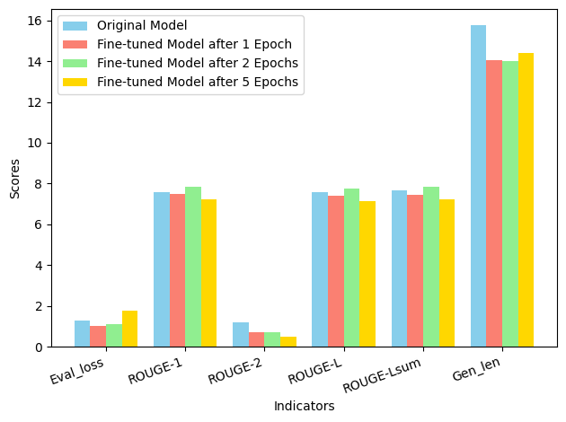

# Paper_title_generation
This repository contains the code and resources for a project focused on generating paper titles from abstracts in Chinese. The project uses a fine-tuned mT5 model to perform the summarization task, aiming to provide accurate and concise titles based on the given abstracts.

### Features

- **Pre-trained Models**: Utilizes the `HeackMT5-ZhSum100k` model for initial training and evaluation.
- **Fine-tuning**: Includes multiple fine-tuned versions of the model to improve performance on specific datasets.
- **Evaluation Metrics**: Employs ROUGE metrics to evaluate the performance of the models.
- **Data Processing**: Includes scripts for preprocessing datasets and tokenizing the text for model input.
- **Training and Evaluation**: Scripts and configurations for training the models and evaluating their performance on test datasets.

### Usage

1. **Loading and Fine-tuning Models**: Code to load pre-trained models and fine-tune them on custom datasets.
2. **Evaluation**: Scripts to evaluate the models using ROUGE metrics and compare the performance of different versions.
3. **Inference**: Example scripts to generate titles from abstracts using the fine-tuned models.

### Requirements

- Python 3.8+
- PyTorch
- Transformers
- Datasets
- ROUGE Score
- Additional dependencies listed in `requirements.txt`

### Getting Started

1. **Clone the repository**:
   ```sh
   git clone https://github.com/yourusername/chinese-paper-title-generation.git
   cd chinese-paper-title-generation

2. **Install the dependencies and download CSL dataset**
3. **Run the training and evaluation scripts:**
   ```sh
   PaperClean.ipynb: Notebook for preprocessing the data.
   PaperTitle.ipynb: Notebook for training the model and generating titles.

The performance evaluation of the four models on the test set reveals the following: The Original Model has a high loss (1.263) and long generation time but decent ROUGE scores. The Fine-tuned Model after 1 epoch has the lowest loss (1.031), good ROUGE scores, and the fastest evaluation speed, making it the most efficient. Fine-tuned Model after 2 epochs shows the highest ROUGE scores but has a higher loss (1.114) and slower evaluation speed. Fine-tuned Model after 5 epochs has the highest loss (1.748) and the lowest ROUGE-2 score, indicating lower performance overall. In summary, the Fine-tuned Model after 2 epochs balances low loss, good ROUGE scores, and fast evaluation, making it the best among the four.


| Model               | eval_loss | eval_rouge1 | eval_rouge2 | eval_rougeL | eval_rougeLsum | eval_gen_len | eval_runtime | eval_samples_per_second | eval_steps_per_second |
|---------------------|-----------|-------------|-------------|-------------|----------------|--------------|--------------|------------------------|-----------------------|
| Original Model      | 1.263     | 7.5571      | 1.1767      | 7.5714      | 7.6779         | 15.773       | 431.7017     | 2.316                  | 0.049                 |
| Fine-tuned Model Epoch1    | 1.031     | 7.4925      | 0.7         | 7.4099      | 7.4257         | 14.044       | 325.5001     | 3.072                  | 0.065                 |
| Fine-tuned Model Epoch2   | 1.114     | 7.8213      | 0.69        | 7.7348      | 7.8231         | 13.999       | 432.3147     | 2.313                  | 0.049                 |
| Fine-tuned Model Epoch5   | 1.748     | 7.223       | 0.5014      | 7.1389      | 7.2078         | 14.389       | 375.9517     | 2.66                   | 0.056                 |





### Acknowledgments

- Thanks to [Chinese Scientific Literature Dataset](https://github.com/ydli-ai/CSL) for providing the dataset.
- Thanks to [Learn NLP with Transformers](https://github.com/datawhalechina/learn-nlp-with-transformers) for the knowledge and practical projects.
- Thanks to [HeackMT5-ZhSum100k](https://huggingface.co/heack/HeackMT5-ZhSum100k) for providing the excellent pre-trained model.
